# Guarden: AI-Powered Pest Monitoring & Control
## 📋 Complete Project Progress & Conversation Log

---

## 📌 Table of Contents

1. [Project Overview](#1-project-overview)
2. [Reference Block Diagram Analysis](#2-reference-block-diagram-analysis)
3. [Architecture Decisions](#3-architecture-decisions)
4. [Feature Breakdown](#4-feature-breakdown)
5. [Task Decomposition](#5-task-decomposition)
6. [Block Diagram](#6-block-diagram)
7. [Transfer Learning Approach](#7-transfer-learning-approach)
8. [Proposed New Features (Pending Answers)](#8-proposed-new-features-pending-answers)
9. [Open Questions Awaiting Answers](#9-open-questions-awaiting-answers)
10. [Progress Tracker](#10-progress-tracker)

---

## 1. Project Overview

### Thesis Title
**Guarden: AI-Powered Pest Monitoring & Control**

### Team Members
- Francine Avielle E. Sayson
- Rinan Geo M. Sundiang
- Haygies Jessica G. Suñga

### Program
Bachelor of Science in Computer Engineering — School of Engineering and Architecture, Holy Angel University

### Date
March 03, 2026

### What is Guarden?
Guarden is an AI-driven pest management and detection system designed for **Filipino household gardeners**. It combines:
- A **motorized rotating camera** (sprinkler-style sweep)
- A **CNN-trained pest detector** (using transfer learning)
- A **solenoid-controlled neem oil sprayer**
- A **mobile application** (real-time alerts, dashboard, logs)

...into a single integrated device that makes smart pest management accessible to the average Filipino home gardener.

### Target Crops (5)
1. Eggplant
2. Tomato
3. Bottle Gourd (Upo)
4. Pechay
5. Okra (Ladyfinger)

### Target Pests (4)
1. Aphids
2. Whiteflies
3. Fruit Borers
4. Leaf Miners

### Core Problem Being Solved
- Late pest detection in household gardens
- Lack of accessible, affordable pest monitoring for small-scale crops
- Overuse/misapplication of chemical pesticides in backyard environments
- No existing system combines AI detection + automated organic pesticide response for home use

### IPO Model (from Concept Paper)
- **Inputs**: RGB camera images, labeled training dataset, user commands from mobile app
- **Process**: 5-stage pipeline — (1) Continuous rotation scan → (2) AI binary stress flagging → (3) Motor freeze + zoom capture → (4) Multi-class pest classification → (5) Decision engine (alert or spray)
- **Outputs**: Automated neem oil spraying, push notifications, plant health dashboard, activity/spray logs, continuous monitoring loop

---

## 2. Reference Block Diagram Analysis

### Source
The reference block diagram comes from: `thesisgroup5_19892_9063994_AI-Ponics_Proposal_Paper (2)-14.pdf` — a previous thesis project called **AI-Ponics**.

### Reference Diagram Format & Template
The AI-Ponics block diagram uses the following visual format:
- **Rounded-rectangle boxes** with text labels inside
- **Directional arrows** showing data/connection flow between components
- **3-column layout**: Left (Software/AI), Center (Communication/APIs), Right (Hardware)
- **White fill** with black borders on all boxes
- **Clean, minimal style** — no colors, no icons, just text boxes and arrows
- **Components in the reference**:
  - TensorflowJS ← Camera Module → Aeroponic Tower
  - Web App (Firebase & ReactJS) ← Blynk API ← ESP32 Module ← Water Pump
  - Gemini AI-Chatbot | Temperature Sensor | Humidity Sensor

### Key Takeaway
The Guarden block diagram must **match this format exactly**: rounded rectangles, directional arrows, clean minimal style, white boxes with black borders.

---

## 3. Architecture Decisions

### Hardware Architecture
| Component | Decision | Rationale |
|---|---|---|
| **Microcontroller** | Arduino Mega | Handles all hardware — sensors, motor, solenoid. Chosen for its 54 digital + 16 analog pins |
| **Software Processing** | Laptop | Handles all software — AI inference, image processing, Firebase communication |
| **Communication** | USB Serial (PySerial) | Laptop ↔ Arduino Mega communication via USB cable. Most reliable, well-documented, low-latency |
| **Network** | WiFi | For laptop → Firebase cloud sync and mobile app connectivity |

### Software Architecture
| Component | Decision | Rationale |
|---|---|---|
| **AI Framework** | Python + TensorFlow/Keras | Industry standard for CNN training & inference; extensive documentation |
| **Transfer Learning** | Yes (model TBD — see Section 7) | Faster training, less data required, higher accuracy with smaller datasets |
| **Image Capture** | OpenCV (cv2) | Industry standard for real-time image processing on laptop |
| **Serial Communication** | PySerial | Python library for laptop ↔ Arduino Mega USB serial communication |
| **Mobile App Framework** | Flutter | Cross-platform (Android + iOS), fast development, thesis-friendly, massive documentation |
| **Backend/Database** | Firebase (Realtime DB + Firestore + FCM) | Real-time sync for dashboard, Firestore for history/logs, FCM for push notifications, no server to manage |

### System Flow
```
Camera (USB/IP) → Laptop (OpenCV captures frames) → CNN Model processes → Detection result
    ↓
Decision Engine → Spray command via Serial → Arduino Mega → Solenoid (Neem Oil)
    ↓
Detection results → Firebase → Flutter Mobile App (Dashboard + Alerts)
```

### Why These Choices?
1. **Arduino Mega for hardware**: More than enough pins for motor + solenoid + future sensors. Well-documented for actuator control.
2. **Laptop for AI**: Full CPU/GPU power for CNN inference. No need for expensive edge devices (Jetson Nano, etc.).
3. **PySerial for communication**: USB Serial is the most reliable bridge between Python (laptop) and Arduino. Zero network latency.
4. **Flutter + Firebase for mobile**: Firebase gives real-time sync (plant health dashboard updates instantly), push notifications (pest alerts), and authentication — all serverless. Flutter enables beautiful cross-platform UI from a single codebase.
5. **Transfer Learning for CNN**: The team does not need to train a model from scratch. Pre-trained weights from large datasets (ImageNet, COCO) provide a strong starting point; fine-tuning on the pest dataset achieves high accuracy with fewer images.

---

## 4. Feature Breakdown

| # | Feature | Description |
|---|---|---|
| **F1** | Motorized Rotating Camera Mount | Arduino Mega controls a motor to rotate the camera in a sprinkler-style sweep across the garden |
| **F2** | Image Capture & Streaming | USB/IP camera connected to laptop; OpenCV captures frames continuously |
| **F3** | AI Stress Detection (Binary) | CNN performs initial low-resolution scan — flags frames as "Stressed" or "Healthy" |
| **F4** | AI Pest Classification (Multi-class) | When stress is detected, high-res capture is analyzed; CNN classifies pest type (Aphids, Whiteflies, Fruit Borers, Leaf Miners) with confidence scores |
| **F5** | Decision Engine | Logic that decides: stress alert only (early warning) OR confirmed pest → trigger spray |
| **F6** | Neem Oil Spraying System | Arduino Mega activates solenoid valve to dispense neem oil to confirmed pest location |
| **F7** | Serial Communication (Laptop ↔ Arduino) | Bidirectional USB Serial communication for commands and sensor data |
| **F8** | Firebase Cloud Sync | Laptop pushes detection results, logs, and status to Firebase in real-time |
| **F9** | Mobile Application | Flutter app with real-time dashboard, push notifications, spray history, and manual override |
| **F10** | Activity Logging & History | Time-stamped records of all detections, alerts, and spray events |
| **F11** | Watering System | **(NEW — Pending Details)** Automated watering mechanism for the garden |
| **F12** | Harvest Readiness Alert | **(NEW — Pending Details)** AI/time-based system to alert gardener when crops are ready for harvest |

---

## 5. Task Decomposition

### F1: Motorized Rotating Camera Mount
| Task ID | Task | Status |
|---|---|---|
| T1.1 | Select and wire DC/stepper motor to Arduino Mega | ⬜ Not Started |
| T1.2 | Write Arduino motor control code (rotation sweep pattern) | ⬜ Not Started |
| T1.3 | Design and fabricate camera mount bracket | ⬜ Not Started |

### F2: Image Capture & Streaming
| Task ID | Task | Status |
|---|---|---|
| T2.1 | Connect USB camera to laptop | ⬜ Not Started |
| T2.2 | Write OpenCV frame capture script | ⬜ Not Started |
| T2.3 | Implement frame preprocessing (resize, normalize) | ⬜ Not Started |

### F3: AI Stress Detection (Binary)
| Task ID | Task | Status |
|---|---|---|
| T3.1 | Collect & label dataset (healthy vs. stressed) for 5 crops | ⬜ Not Started |
| T3.2 | Augment dataset (rotation, flip, brightness) | ⬜ Not Started |
| T3.3 | Train binary CNN classifier using transfer learning | ⬜ Not Started |
| T3.4 | Validate model ≥ 85% accuracy | ⬜ Not Started |

### F4: AI Pest Classification (Multi-class)
| Task ID | Task | Status |
|---|---|---|
| T4.1 | Collect & label pest-specific dataset (4 pest classes) | ⬜ Not Started |
| T4.2 | Train multi-class CNN pest classifier using transfer learning | ⬜ Not Started |
| T4.3 | Evaluate with accuracy, precision, recall, F1-score | ⬜ Not Started |

### F5: Decision Engine
| Task ID | Task | Status |
|---|---|---|
| T5.1 | Implement decision logic (stress → alert; pest confirmed → spray) | ⬜ Not Started |
| T5.2 | Define confidence thresholds for spray activation | ⬜ Not Started |

### F6: Neem Oil Spraying System
| Task ID | Task | Status |
|---|---|---|
| T6.1 | Wire solenoid valve + relay to Arduino Mega | ⬜ Not Started |
| T6.2 | Write Arduino spray control code (timed neem oil release) | ⬜ Not Started |
| T6.3 | Test spray targeting accuracy | ⬜ Not Started |

### F7: Serial Communication (Laptop ↔ Arduino)
| Task ID | Task | Status |
|---|---|---|
| T7.1 | Implement PySerial on laptop side | ⬜ Not Started |
| T7.2 | Implement Serial listener on Arduino side | ⬜ Not Started |
| T7.3 | Define communication protocol (command format) | ⬜ Not Started |

### F8: Firebase Cloud Sync
| Task ID | Task | Status |
|---|---|---|
| T8.1 | Set up Firebase project (Realtime DB + FCM) | ⬜ Not Started |
| T8.2 | Write Python Firebase push script on laptop | ⬜ Not Started |
| T8.3 | Structure database schema (detections, logs, status) | ⬜ Not Started |

### F9: Mobile Application (Flutter)
| Task ID | Task | Status |
|---|---|---|
| T9.1 | Set up Flutter project | ⬜ Not Started |
| T9.2 | Build real-time plant health dashboard screen | ⬜ Not Started |
| T9.3 | Implement push notifications (pest alerts) | ⬜ Not Started |
| T9.4 | Build spray history/activity log screen | ⬜ Not Started |
| T9.5 | Implement manual spray override button | ⬜ Not Started |
| T9.6 | SUS (System Usability Scale) testing with users | ⬜ Not Started |

### F10: Activity Logging & History
| Task ID | Task | Status |
|---|---|---|
| T10.1 | Implement timestamp logging for all events | ⬜ Not Started |
| T10.2 | Store logs in Firebase Firestore | ⬜ Not Started |

### F11: Watering System *(NEW — Tasks pending answers)*
| Task ID | Task | Status |
|---|---|---|
| T11.x | Tasks to be defined after answering questions | ⏳ Pending |

### F12: Harvest Readiness Alert *(NEW — Tasks pending answers)*
| Task ID | Task | Status |
|---|---|---|
| T12.x | Tasks to be defined after answering questions | ⏳ Pending |

---

## 6. Block Diagram

### Format
Matches the reference AI-Ponics block diagram **exactly**: rounded-rectangle boxes, directional arrows, white fill, black borders, clean minimal style.

### Current Block Diagram (Mermaid — before new features)

```mermaid
graph LR
    %% ===== HARDWARE SIDE (Right) =====
    CAM["Camera Module<br/>(USB/IP Camera)"]
    MOTOR["DC/Stepper<br/>Motor"]
    SOLENOID["Solenoid Valve<br/>(Neem Oil Sprayer)"]
    ARDUINO["Arduino Mega"]

    %% ===== COMMUNICATION (Center) =====
    SERIAL["Serial<br/>Communication<br/>(USB)"]
    FIREBASE["Firebase<br/>(Realtime DB + FCM)"]
    WIFI["WiFi<br/>Module"]

    %% ===== SOFTWARE SIDE (Left) =====
    OPENCV["OpenCV<br/>(Image Capture)"]
    CNN["CNN Model<br/>(TensorFlow/Keras)"]
    DECISION["Decision<br/>Engine"]
    FLUTTER["Mobile App<br/>(Flutter)"]

    %% ===== CONNECTIONS =====
    CAM --> OPENCV
    OPENCV --> CNN
    CNN --> DECISION
    DECISION -->|"Spray Command"| SERIAL
    DECISION -->|"Detection Results"| FIREBASE
    SERIAL --> ARDUINO
    ARDUINO --> MOTOR
    ARDUINO --> SOLENOID
    FIREBASE --> FLUTTER
    FLUTTER -->|"Manual Override"| FIREBASE
    FIREBASE -->|"Override Command"| SERIAL
    WIFI --> FIREBASE

    %% ===== STYLING =====
    style CAM fill:#fff,stroke:#000,stroke-width:2px,rx:10,ry:10
    style MOTOR fill:#fff,stroke:#000,stroke-width:2px,rx:10,ry:10
    style SOLENOID fill:#fff,stroke:#000,stroke-width:2px,rx:10,ry:10
    style ARDUINO fill:#fff,stroke:#000,stroke-width:2px,rx:10,ry:10
    style SERIAL fill:#fff,stroke:#000,stroke-width:2px,rx:10,ry:10
    style FIREBASE fill:#fff,stroke:#000,stroke-width:2px,rx:10,ry:10
    style WIFI fill:#fff,stroke:#000,stroke-width:2px,rx:10,ry:10
    style OPENCV fill:#fff,stroke:#000,stroke-width:2px,rx:10,ry:10
    style CNN fill:#fff,stroke:#000,stroke-width:2px,rx:10,ry:10
    style DECISION fill:#fff,stroke:#000,stroke-width:2px,rx:10,ry:10
    style FLUTTER fill:#fff,stroke:#000,stroke-width:2px,rx:10,ry:10
```



### ASCII Layout (for recreating in Draw.io / PowerPoint)

```
┌─────────────────────────────────────────────────────────────────────────┐
│                   System Block Diagram of Guarden                       │
│                                                                         │
│  ┌───────────┐     ┌───────────┐     ┌───────────┐                     │
│  │  CNN Model │◄────│  OpenCV   │◄────│  Camera   │                     │
│  │(TensorFlow/│     │ (Image    │     │  Module   │                     │
│  │  Keras)    │     │ Capture)  │     │(USB/IP)   │                     │
│  └─────┬─────┘     └───────────┘     └───────────┘                     │
│        │                                                                │
│        ▼                                                                │
│  ┌───────────┐     ┌───────────┐     ┌───────────┐     ┌───────────┐  │
│  │ Decision  │────►│  Serial   │────►│  Arduino  │────►│ DC/Stepper│  │
│  │  Engine   │     │  Comms    │     │   Mega    │     │   Motor   │  │
│  └─────┬─────┘     │  (USB)    │     └─────┬─────┘     └───────────┘  │
│        │           └───────────┘           │                           │
│        ▼                                   ▼                           │
│  ┌───────────┐                       ┌───────────┐                     │
│  │ Firebase  │                       │ Solenoid  │                     │
│  │(Realtime  │                       │  Valve    │                     │
│  │DB + FCM)  │                       │(Neem Oil) │                     │
│  └─────┬─────┘                       └───────────┘                     │
│        │                                                                │
│        ▼                                                                │
│  ┌───────────┐                                                         │
│  │Mobile App │                                                         │
│  │ (Flutter) │                                                         │
│  └───────────┘                                                         │
│                                                                         │
└─────────────────────────────────────────────────────────────────────────┘
```

> ⚠️ **Note**: This block diagram will be updated once the Watering System (F11) and Harvest Readiness Alert (F12) details are finalized.

---

## 7. Transfer Learning Approach

### Decision
The team decided to use **transfer learning** rather than training a CNN from scratch.

### Why Transfer Learning?
- **Faster training** — leverages pre-trained weights from massive datasets
- **Less data required** — fine-tuning needs fewer labeled images than training from scratch
- **Higher accuracy** — pre-trained models already understand visual features (edges, textures, shapes)
- **Industry standard** — most recent agricultural AI papers (2023-2025) use transfer learning

### Model Options Presented (Awaiting Final Decision)

| Model | Parameters | Speed | Accuracy | Best For | Recommendation |
|---|---|---|---|---|---|
| **YOLOv8** | ~3-11M | ⚡ Very Fast | 🟢 High | Real-time object detection (WHERE + WHAT) | ⭐ **Recommended** — aligns with real-time rotating camera + targeted spraying |
| **MobileNetV2** | ~3.4M | ⚡ Very Fast | 🟡 Good | Lightweight classification | Good if laptop is low-spec |
| **ResNet50** | ~25.6M | 🟡 Medium | 🟢 High | High-accuracy classification | Good for accuracy-first |
| **EfficientNetB0-B4** | ~5-19M | 🟡 Medium | 🟢 Very High | Best accuracy-to-size ratio | Great balance |
| **VGG16** | ~138M | 🔴 Slow | 🟢 High | Classic, well-documented | Common in thesis but outdated |

### Detection vs. Classification (Awaiting Decision)
- **Classification**: Image → Label ("Aphids 92%")
- **Object Detection**: Image → Bounding boxes + labels (finds WHERE pests are)
- Object detection better aligns with "targeted spraying" in the concept paper

### Two-Stage Pipeline Options (Awaiting Decision)
- **Option A**: Two separate models (binary stress + multi-class pest)
- **Option B**: One unified model (single pass)
- **Option C**: Let Copilot recommend

### Pending Questions
- Which pre-trained model to use?
- Detection vs. classification approach?
- Two-stage pipeline option (A, B, or C)?
- Laptop specs (GPU? RAM?)
- Estimated dataset size per crop per pest?

---

## 8. Proposed New Features (Pending Answers)

### F11: Watering System
**Status**: Proposed — awaiting answers to design questions

**Questions asked:**
1. What type of watering mechanism? (drip irrigation, sprinkler, or recommended?)
2. How to control water flow? (solenoid valve, water pump, or both?)
3. What triggers watering? (soil moisture sensor, scheduled timer, both, manual override?)
4. Per-crop watering control or one system for entire garden?
5. Soil moisture sensor preference? (capacitive, resistive, or recommended?)
6. Mobile app features for watering? (real-time moisture, history, manual button?)

### F12: Harvest Readiness Alert
**Status**: Proposed — awaiting answers to design questions

**Questions asked:**
1. Detection method? (AI/computer vision, time-based, both, sensor-based?)
2. Visual cues for harvest readiness per crop?
3. Separate AI model or integrated into existing CNN pipeline?
4. Alert type? (push notification, dashboard indicator, both?)
5. Track growth stages? (Seedling → Vegetative → Flowering → Fruiting → Harvest-Ready?)
6. User input for planting date via app?
7. Harvest history logging?

### Integration Questions
1. Should watering auto-adjust based on pest detection? (reduce water if fungal pests detected?)
2. Priority conflict: pest detected AND soil dry at same time — what happens first?
3. Arduino Mega pin count verification for all hardware
4. Block diagram layout preference for new features

---

## 9. Open Questions Awaiting Answers

### Transfer Learning Questions
- [ ] Which pre-trained model? (YOLOv8 recommended)
- [ ] Detection vs. classification?
- [ ] Two-stage pipeline option (A, B, or C)?
- [ ] Laptop specs (GPU, RAM)?
- [ ] Estimated dataset size?

### Watering System Questions
- [ ] Watering mechanism type?
- [ ] Water flow control method?
- [ ] Watering trigger?
- [ ] Per-crop or whole-garden?
- [ ] Soil moisture sensor choice?
- [ ] Mobile app watering features?

### Harvest Readiness Questions
- [ ] Detection method?
- [ ] Visual cues per crop?
- [ ] Separate or integrated AI model?
- [ ] Alert type?
- [ ] Growth stage tracking?
- [ ] Planting date input?
- [ ] Harvest history logging?

### Integration Questions
- [ ] Watering auto-adjust based on pest detection?
- [ ] Priority conflict handling?
- [ ] Arduino Mega pin verification?
- [ ] Block diagram layout for new features?

---

## 10. Progress Tracker

| # | Action | Status | Date | Notes |
|---|---|---|---|---|
| 1 | Analyzed reference block diagram (AI-Ponics PDF) | ✅ Done | 2026-03-11 | Identified format: rounded boxes, arrows, 3-column layout, white fill, black borders |
| 2 | Read & analyzed full Guarden concept paper (DOCX) | ✅ Done | 2026-03-11 | Extracted all components, IPO model, objectives, scope, significance, literature review |
| 3 | Recommended hardware architecture | ✅ Done | 2026-03-11 | Arduino Mega (hardware) + Laptop (software) + USB Serial (communication) |
| 4 | Recommended AI architecture | ✅ Done | 2026-03-11 | Python + TensorFlow/Keras + OpenCV + PySerial, Transfer Learning approach |
| 5 | Recommended mobile app stack | ✅ Done | 2026-03-11 | Flutter + Firebase (Realtime DB + Firestore + FCM) |
| 6 | Decomposed system into 10 features (F1-F10) | ✅ Done | 2026-03-11 | Core system features fully defined |
| 7 | Broke features into 30 granular tasks | ✅ Done | 2026-03-11 | T1.1–T10.2 with status tracking |
| 8 | Created block diagram (Mermaid + ASCII) | ✅ Done | 2026-03-11 | Matches reference format exactly |
| 9 | Presented transfer learning model options | ✅ Done | 2026-03-11 | YOLOv8 recommended; awaiting team decision |
| 10 | Proposed Watering System feature (F11) | ✅ Done | 2026-03-11 | Questions asked; awaiting answers |
| 11 | Proposed Harvest Readiness Alert feature (F12) | ✅ Done | 2026-03-11 | Questions asked; awaiting answers |
| 12 | Created comprehensive PROGRESS.md | ✅ Done | 2026-03-11 | This file — full conversation log pushed to repo |
| 13 | Awaiting answers to finalize F11, F12, and transfer learning | ⏳ Pending | — | Team needs to answer open questions |
| 14 | Update block diagram with F11 + F12 | ⬜ Not Started | — | Will be done after answers received |
| 15 | Finalize task decomposition for F11 + F12 | ⬜ Not Started | — | Will be done after answers received |

---

## 📎 Repository Files

| File | Description |
|---|---|
| `Group5_PreApproved_ConceptPaper2 (1).docx` | Full concept paper for Guarden thesis |
| `thesisgroup5_19892_9063994_AI-Ponics_Proposal_Paper (2)-14.pdf` | Reference block diagram source (AI-Ponics) |
| `PROGRESS.md` | This file — comprehensive project progress and conversation log |

---

*Last updated: 2026-03-11 02:42:59 UTC*
*Maintained by: GitHub Copilot in collaboration with Rinan Geo M. Sundiang*